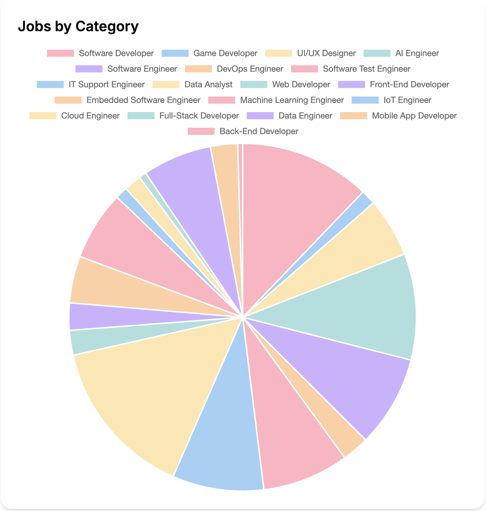
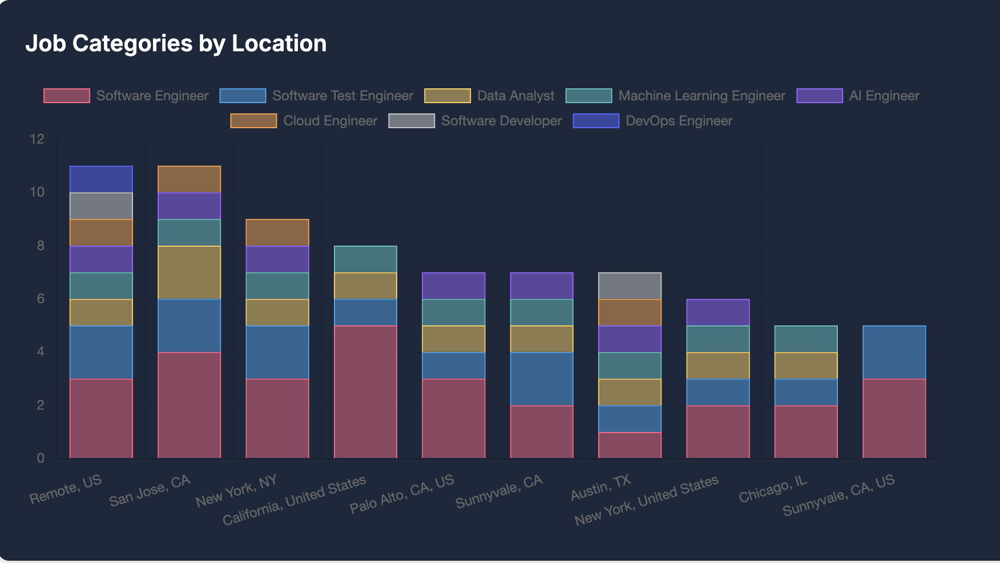
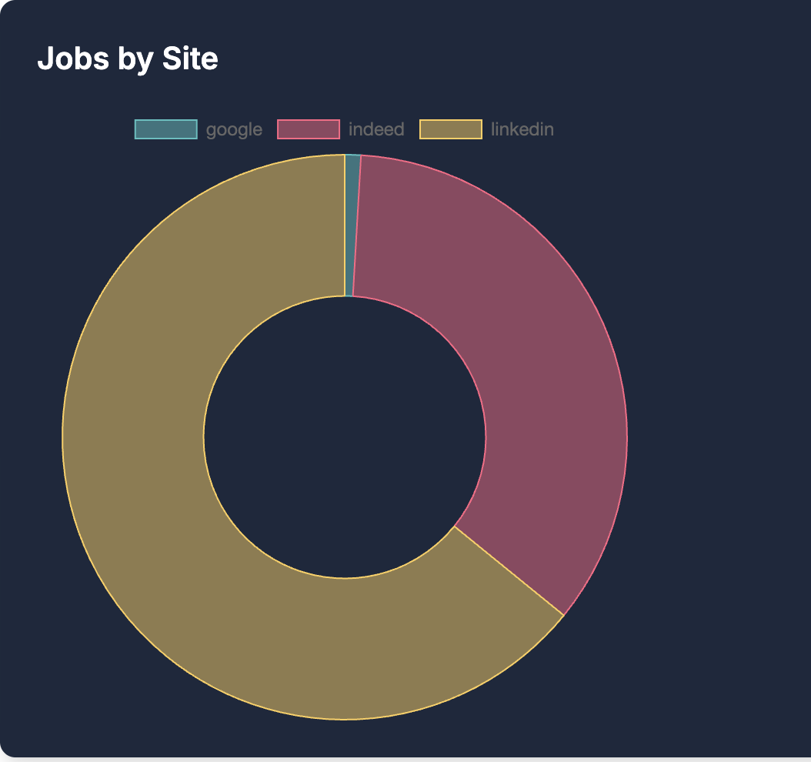

# 🚀 Entry-Level Jobs Dashboard

<div align="center">
  
  
  
  
  
</div>

<br />

<div align="center">
  <h3>🔍 Find entry-level jobs. Instantly. Intelligently.</h3>
  <p>A cutting-edge platform that leverages AI and machine learning to connect job seekers with entry-level opportunities perfectly suited to their skills and experience.</p>
</div>

---

## 📋 Overview

The Entry-Level Jobs Dashboard is a comprehensive web application designed to revolutionize how job seekers find their first career opportunities. Built with Next.js and Firebase, it combines powerful job aggregation with AI-driven matching technology to create a seamless job discovery experience. The platform automatically collects entry-level positions from major job boards, analyzes them using machine learning, and presents jobs. With real-time analytics and intuitive filtering, users can explore the job market visually, and find positions that truly match their qualifications—all in one centralized dashboard.

---

## ✨ Features

<table>
  <tr>
    <td width="50%">
      <h3>🤖 AI-Powered Job Matching</h3>
      <ul>
        <li>Resume analysis with OpenAI integration</li>
        <li>Percentage-based match scoring system</li>
        <li>Personalized recommendations based on resume</li>
      </ul>
    </td>
    <td width="50%">
      <h3>🌐 Multi-Source Aggregation</h3>
      <ul>
        <li>Jobs from LinkedIn, Indeed, Google Jobs</li>
        <li>Real-time updates with hourly scraping</li>
        <li>Intelligent entry-level classification</li>
      </ul>
    </td>
  </tr>
  <tr>
    <td width="50%">
      <h3>📊 Interactive Dashboard</h3>
      <ul>
        <li>Real-time job analytics</li>
        <li>Customizable job filters</li>
        <li>Visually appealing charts</li>
      </ul>
    </td>
    <td width="50%">
      <h3>🔐 Secure Authentication</h3>
      <ul>
        <li>Firebase Authentication</li>
        <li>Profile management</li>
        <li>Resume storage and versioning</li>
      </ul>
    </td>
  </tr>
</table>

---

## 🔄 How It Works & Usage Guide

### Platform Workflow

1. **Job Collection**: Our automated systems continuously scan multiple job boards (LinkedIn, Indeed, Google Jobs) for new listings
2. **ML Classification**: Each job is analyzed by our TF-IDF + XGBoost model to determine if it's truly entry-level
3. **Database Storage**: Verified entry-level positions are stored in Firestore with metadata enrichment
4. **User Authentication**: Create an account or sign in with your preferred authentication method
5. **Resume Upload**: Submit your resume in PDF format for AI analysis
6. **Skill Extraction**: Our OpenAI integration extracts your key skills and experience from your resume
7. **Job Matching**: The system compares your profile against job description to generate match score

### Step-by-Step Usage Guide

1. **Sign Up/Login**: Create an account using email, or Google authentication
2. **Complete Profile**: Add your basic information
3. **Upload Resume**: Submit your most recent resume for analysis
4. **Explore Dashboard**: View Jobs scraped from multiple job boards
5. **Filter Results**: Narrow down jobs by location, job type, or job category
6. **View Job Details**: Click on any job to see full description, requirements, and application instructions
7. **Check Match Analysis**: Review the detailed breakdown of why certain job match your profile
8. **Identify Skill Gaps**: See which skills you're missing for your target positions

The platform works best when you keep your profile and resume updated to ensure the most accurate job matching. 

---

## 📊 Dashboard & Analytics Showcase

<div align="center">
  <h3>Comprehensive Visual Analytics for Entry-Level Job Market</h3>
  <p>Our interactive dashboard provides real-time insights into the job market with customizable filters and data visualizations.</p>
  
  <table>
    <tr>
      <td align="center">
        
        <p><strong>Jobs Distribution by Category</strong></p>
        <p>Interactive breakdown of available positions across different professional fields</p>
      </td>
      <td align="center">
        
        <p><strong>Jobs Distribution by Category</strong></p>
      </td>
    </tr>
    <tr>
      <td align="center">
        
        <p>Track job posting trends with time-series visualization</p>
      </td>
    </tr>
  </table>
  
  
  <table>
    <tr>
      <td align="center" width="33%">
        
        <p><strong>Job categories by Location</strong></p>
        <p>Identify regions and types of jobs available</p>
      </td>
      <td align="center" width="33%">
        
        <p><strong>Jobs by Site</strong></p>
      </td>
      <td align="center" width="33%">
        
        <p><strong>Types of Jobs</strong></p>
      </td>
    </tr>
  </table>
</div>

---

## 🛠️ Tech Stack

### Frontend
- **Next.js 15.2.3** - React framework with App Router
- **React 19.0.0** - UI library
- **TypeScript** - Type safety
- **Tailwind CSS 4** - Utility-first CSS
- **Chart.js & Recharts** - Data visualization
- **shadcn/ui** - UI component library

### Backend
- **Firebase** - Authentication, database, and storage
- **Python** - Job scraping and ML classification (TF-IDF + XGBoost)
- **OpenAI API** - Resume analysis and job matching

### Data
- **Firestore** - NoSQL database for job storage
- **Firebase Storage** - Resume storage
- **Firebase Functions** - Serverless functions for background tasks

---

## 📂 Project Structure

```
entry_level_jobs_dashboard/
├── app/                       # Next.js 13+ App Router
│   ├── (application)/         # Protected app routes
│   │   ├── dashboard/         # Main dashboard
│   │   │   └── job/           # Job details pages
│   │   ├── profile/           # User profile management
│   │   ├── resume/            # Resume upload & analysis
│   │   └── analytics/         # Job market analytics
│   ├── api/                   # API routes
│   ├── page.tsx               # Landing page
│   └── layout.tsx             # Root layout
├── components/                # Reusable UI components
│   ├── ui/                    # shadcn/ui components
│   └── auth/                  # Authentication components
├── lib/                       # Core utilities
│   ├── firebase/              # Firebase configuration
│   ├── jobs/                  # Job-related utilities
│   └── auth-context.tsx       # Authentication context
├── public/                    # Static assets
├── .env.local                 # Environment variables
└── next.config.ts             # Next.js configuration
```

---

## 🚀 Getting Started

### Prerequisites
- Node.js 18+ and npm
- Firebase account
- OpenAI API key

### Installation

1. **Clone the repository**
   ```bash
   git clone https://github.com/malli7/entry_level_jobs_dashboard.git
   cd entry_level_jobs_dashboard
   ```

2. **Install dependencies**
   ```bash
   npm install
   ```

3. **Set up environment variables**
   Create a `.env.local` file with the following:
   ```
   NEXT_PUBLIC_FIREBASE_API_KEY=your_key
   NEXT_PUBLIC_FIREBASE_AUTH_DOMAIN=your_project.firebaseapp.com
   NEXT_PUBLIC_FIREBASE_PROJECT_ID=your_project_id
   NEXT_PUBLIC_FIREBASE_STORAGE_BUCKET=your_bucket
   NEXT_PUBLIC_FIREBASE_MESSAGING_SENDER_ID=your_sender_id
   NEXT_PUBLIC_FIREBASE_APP_ID=your_app_id
   NEXT_PUBLIC_OPENAI_API_KEY=your_openai_key
   ```

4. **Start the development server**
   ```bash
   npm run dev
   ```
   The application will be available at `http://localhost:3000`.

5. **Build for production**
   ```bash
   npm run build
   npm start
   ```

---

## 🧩 Core Features Explained

### AI-Powered Job Matching

Our platform uses OpenAI to analyze uploaded resumes and compare them against job descriptions. The system:

1. Extracts key skills and experience from resumes
2. Identifies required and preferred qualifications from job descriptions
3. Calculates a match percentage based on skill alignment
4. Provides actionable feedback on missing skills

### Job Aggregation & Classification

The backend scraping system:

1. Collects job listings from multiple sources
2. Uses a ML model (TF-IDF + XGBoost) to classify roles as entry-level
3. Enriches listings with additional metadata (company info, location data)
4. Stores everything in Firestore with automatic pruning of outdated listings

### Interactive Data Visualization

The dashboard presents:

- Jobs by category and location
- Trends in hiring over time
- Custom filters for job type, location, and industry

---

## 🧪 Future Enhancements

- [ ] **Mobile Application** - React Native version for on-the-go job searching
- [ ] **Resume Builder** - AI-powered resume creation tools
- [ ] **Interview Preparation** - Practice questions based on job requirements
- [ ] **Networking Features** - Connect with other job seekers and mentors

---

## 👨‍💻 Contributing

Contributions are welcome! Please feel free to submit a Pull Request.

1. Fork the repository
2. Create your feature branch (`git checkout -b feature/amazing-feature`)
3. Commit your changes (`git commit -m 'Add some amazing feature'`)
4. Push to the branch (`git push origin feature/amazing-feature`)
5. Open a Pull Request

---

## 📄 License

This project is licensed under the MIT License - see the [LICENSE](LICENSE) file for details.

---

<div align="center">
  <p>Built with ❤️ for job seekers at all stages of their career journey</p>
  <p>© 2025 Entry-Level Jobs Dashboard</p>
</div>

